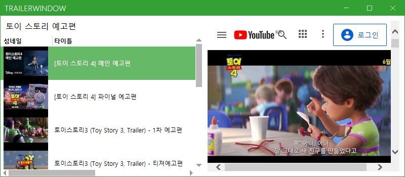

# MiniProject_Desktop
미니프로젝트 데스크탑 앱

    - ERP 재고관리 앱
    
    - Naver Movie Finder

    - Commons.cs

## ERP 재고관리 앱

- DB에서 사용자 정보를 가져와 로그인 기능 제공

    </img>

    [LoginView](WpfSMSApp/WpfSMSApp/View/LoginView.xaml.cs)

- 로그인한 사용자의 정보 보기, 수정 기능

    </img>

    [UserList](https://github.com/choiyeonseong/MiniProject_Desktop/tree/main/WpfSMSApp/WpfSMSApp/View/Account)

- 사용자 리스트 보기, 추가, 수정, 비활성화, PDF 익스포트 기능

    </img>
    
    [UserList](https://github.com/choiyeonseong/MiniProject_Desktop/tree/main/WpfSMSApp/WpfSMSApp/View/User)

```C#
// 0.PDF 사용 폰트 설정
string nanumPath = Path.Combine(Environment.CurrentDirectory, @"NanumGothic.ttf");
BaseFont nanumBase = BaseFont.CreateFont(nanumPath, BaseFont.IDENTITY_H, BaseFont.EMBEDDED);
var nanumTitle = new iTextSharp.text.Font(nanumBase, 20f);  // 20 타이틀용 나눔폰트 
var nanumContent = new iTextSharp.text.Font(nanumBase, 12f);  // 12 내용 나눔폰트 

string pdfFilePath = saveDialog.FileName;

// 1. PDF 객체 생성
iTextSharp.text.Document pdfDoc = new Document(PageSize.A4);

// 2. PDF 내용 만들기
Paragraph title = new Paragraph("부경대 재고관리시스템(SMS)\n", nanumTitle);
Paragraph subTitle = new Paragraph($"사용자리스트 exported : {DateTime.Now.ToString("yyyy-MM-dd HH:mm:ss")}\n\n", nanumContent);

PdfPTable pdfTable = new PdfPTable(GrdData.Columns.Count);
pdfTable.WidthPercentage = 100; // 전체 사이즈 다 사용

// 그리드 헤더 작업
foreach (DataGridColumn column in GrdData.Columns)
{
    PdfPCell cell = new PdfPCell(new Phrase(column.Header.ToString(), nanumContent));
    cell.HorizontalAlignment = Element.ALIGN_CENTER;

    pdfTable.AddCell(cell);
}

// 각 셀의 사이즈 조정
float[] columnsWidth = new float[] { 5f, 15f, 10f, 15f, 30f, 12f, 10f };
pdfTable.SetWidths(columnsWidth);

// 그리드 Row 작업
foreach (var item in GrdData.Items)
{
    if (item is Model.User)
    {
        var temp = item as Model.User;
        // UserId
        PdfPCell cell = new PdfPCell(new Phrase(temp.UserID.ToString(), nanumContent));
        cell.HorizontalAlignment = Element.ALIGN_RIGHT;
        pdfTable.AddCell(cell);
        /* 각 컬럼에 대해 위 과정 반복 */
    }
}

// 3. PDF 파일 생성
using (FileStream stream = new FileStream(pdfFilePath, FileMode.OpenOrCreate))
{
    PdfWriter.GetInstance(pdfDoc, stream);
    pdfDoc.Open();

    // 2번에서 만든 내용 추가
    pdfDoc.Add(title);
    pdfDoc.Add(subTitle);
    pdfDoc.Add(pdfTable);

    pdfDoc.Close();
    stream.Close(); // option
}
```

- 창고 리스트 보기, 추가, 수정, Excel 익스포트 기능

    </img>

    
    [StoreList](https://github.com/choiyeonseong/MiniProject_Desktop/tree/main/WpfSMSApp/WpfSMSApp/View/Store)

```C#
IWorkbook workbook = new XSSFWorkbook(); // .xlsx
// new HSSFWorkbook(); // .xls(이전버전용)
ISheet sheet = workbook.CreateSheet("SMS StoreList");

// 헤더 row 생성
IRow rowHeader = sheet.CreateRow(0);
ICell cell = rowHeader.CreateCell(0);
cell.SetCellValue("순번");

cell = rowHeader.CreateCell(1);
cell.SetCellValue("창고명");

cell = rowHeader.CreateCell(2);
cell.SetCellValue("창고위치");

cell = rowHeader.CreateCell(3);
cell.SetCellValue("재고수");

// 데이터 생성
for (int i = 0; i < GrdData.Items.Count; i++)
{
    IRow row = sheet.CreateRow(i + 1);
    if (GrdData.Items[i] is Model.StockStore)   // 빈값인 경우를 막아줌
    {
        var stockStore = GrdData.Items[i] as Model.StockStore;
        ICell dataCell = row.CreateCell(0);
        dataCell.SetCellValue(stockStore.StoreID);
        dataCell = row.CreateCell(1);
        dataCell.SetCellValue(stockStore.StoreName);
        dataCell = row.CreateCell(2);
        dataCell.SetCellValue(stockStore.StoreLocation);
        dataCell = row.CreateCell(3);
        dataCell.SetCellValue(stockStore.StockQuantity);
    }
}

// 파일저장
using (var fs = new FileStream(dialog.FileName, FileMode.OpenOrCreate, FileAccess.Write))
{
    workbook.Write(fs);
}
```

--------------

## Naver Movie Finder

- Naver API를 사용하여 영화 정보 조회, 네이버 영화에서 검색 가능하도록 구현

    </img>

    [NaverMovieAPI](NaverMovieFinderApp/NaverMovieFinderApp/MainWindow.xaml.cs)

```C#
// 사용자 정보 입력
string clientID = "API 아이디";
string clientSecret = "API 비밀번호";

string openApiUrl = $"https://openapi.naver.com/v1/search/movie?start=1&display=30&query={movieName}";

// request 요청
string resJson = Commons.GetOpenApiResult(openApiUrl, clientID, clientSecret);
var parsedJson = JObject.Parse(resJson);

int total = Convert.ToInt32(parsedJson["total"]);
int display = Convert.ToInt32(parsedJson["display"]);

StsResult.Content = $"{total} 중 {display} 호출 성공";

JToken items = parsedJson["items"];
JArray json_array = (JArray)items;

List<MovieItem> movieItems = new List<MovieItem>();

foreach (var item in json_array)
{
    MovieItem movie = new MovieItem(
        Commons.StripHTMLTag(item["title"].ToString()),
        item["link"].ToString(),
        item["image"].ToString(),
        item["subtitle"].ToString(),
        item["pubDate"].ToString(),
        Commons.StripPipe(item["director"].ToString()),
        Commons.StripPipe(item["actor"].ToString()),
        item["userRating"].ToString()
        );
    movieItems.Add(movie);
}

this.DataContext = movieItems;
```

- DB를 이용해서 즐겨찾기 추가, 삭제, 보기 기능 구현

    </img>

    [Entity Framework](NaverMovieFinderApp/NaverMovieFinderApp/MainWindow.xaml.cs)

    </img>

- Youtube API를 사용하여 해당 영화의 티저 재생

    </img>

    [YoutubeTrailerWindow](NaverMovieFinderApp/NaverMovieFinderApp/TrailerWindow.xaml.cs)

```C#
var youtubeService = new YouTubeService(
    new BaseClientService.Initializer()
    {
        ApiKey = "개인키",
        ApplicationName = this.GetType().ToString()
    });

var request = youtubeService.Search.List("snippet");    // snippet 조각
request.Q = LblMovieName.Content.ToString();   // {영화이름} 예고편
request.MaxResults = 10; // 사이즈가 크면 멈춰버림

var response = await request.ExecuteAsync(); // 검색시작(youtube OpenAPI 호출)

foreach (var item in response.Items)
{
    if (item.Id.Kind.Equals("youtube#video"))
    {
        YoutubeItem youtube = new YoutubeItem()
        {
            Title = item.Snippet.Title,
            Author = item.Snippet.ChannelTitle,
            URL = $"https://www.youtube.com/watch?v={item.Id.VideoId}"
        };
        // thumbnail image
        youtube.Thumbnail = new BitmapImage(new Uri(item.Snippet.Thumbnails.Default__.Url, UriKind.RelativeOrAbsolute));
    
        youtubes.Add(youtube);
    }
}
```

--------------

## Commons.cs

#### OpenAPI Request & Response 메소드

```C#
public static string GetOpenApiResult(string openApiUrl, string clientID, string clientSecret)
{
    var result = "";

    try
    {
        WebRequest request = WebRequest.Create(openApiUrl);
        request.Headers.Add("X-Naver-Client-Id", clientID);
        request.Headers.Add("X-Naver-Client-Secret", clientSecret);

        WebResponse response = request.GetResponse();
        Stream stream = response.GetResponseStream();
        StreamReader reader = new StreamReader(stream);

        result = reader.ReadToEnd();

        reader.Close();
        stream.Close();
        response.Close();
    }
    catch (Exception ex)
    {
        Console.WriteLine($"예외발생: {ex}");
    }
    return result;
}
```

#### 비밀번호 암호화 메소드

```C#
public static string GetMd5Hash(MD5 md5Hash, string plainStr)
{
    byte[] data = md5Hash.ComputeHash(Encoding.UTF8.GetBytes(plainStr));
    StringBuilder builder = new StringBuilder();
    for (int i = 0; i < data.Length; i++)
    {
        builder.Append(data[i].ToString("x2")); // 16진수로 바꿈
    }

    return builder.ToString();
}
```

#### 이메일 정규식 체크 메소드

```C#
public static bool IsValidEmail(string email)
{
    return Regex.IsMatch(email, @"[a-zA-Z0-9!#$%&'*+/=?^_`{|}~-]+(?:\.[a-zA-Z0-9!#$%&'*+/=?^_`{|}~-]+)*@(?:[a-zA-Z0-9](?:[a-zA-Z0-9-]*[a-zA-Z0-9])?\.)+[a-zA-Z0-9](?:[a-zA-Z0-9-]*[a-zA-Z0-9])?");
}
```

#### HTML 태그 삭제 정규식 메소드

```C#
public static string StripHTMLTag(string text)
{
    text = Regex.Replace(text, @"<(.|\n)*?>", "");  // HTML 태그
    text = Regex.Replace(text, "&amp;", "&");       // &amp;
    return text;
}
```